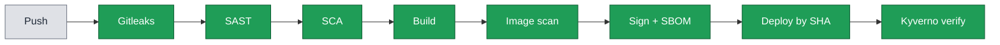
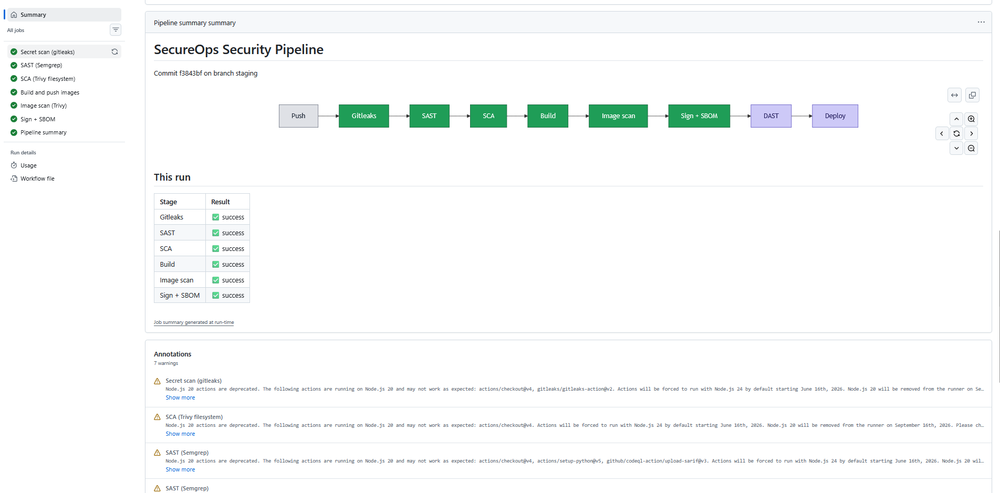
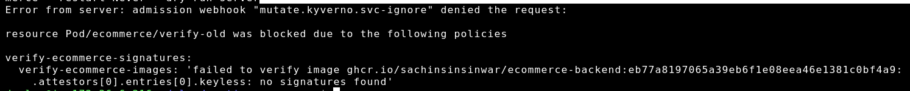

# SecureOps

A hands-on DevSecOps project. A containerised e-commerce app is turned into a secured software supply chain: security runs on every push (secret scanning, SAST, dependency scanning, container scanning, keyless signing, SBOM attestation), and the Kubernetes cluster refuses to run any image it cannot prove came from this pipeline.

[](https://github.com/sachinsinsinwar/cloud-native-ecommerce/actions/workflows/security-pipeline.yml)

> **Scope.** The e-commerce app is a sample workload. The engineering focus of this project is the security pipeline, the supply-chain controls, and the platform hardening around it. That is where the work is.

## Pipeline



Every push runs this. If any gate fails, the build stops. Only images that pass every gate get built, scanned, signed, and deployed.



## What runs on every push

| Stage | Tool | What it checks |
| :-- | :-- | :-- |
| Secret scan | Gitleaks | no credentials or keys committed |
| SAST | Semgrep | bugs in the app's own code |
| SCA | Trivy (filesystem) | known CVEs in dependencies |
| Build | Docker Buildx, pushed to ghcr.io | builds and pushes images tagged by commit SHA |
| Image scan | Trivy (image) | CVEs in the whole container, base OS included |
| Sign + SBOM | Cosign (keyless) and Syft | signs each image and attaches a Software Bill of Materials |
| Summary | GitHub job summary | a colour pipeline view on the run page |

## Supply-chain enforcement (the core idea)

Signing does nothing on its own. Something has to check it. So the cluster runs **Kyverno** as an admission controller with one rule: any `ghcr.io/sachinsinsinwar/ecommerce-*` image must carry a valid keyless Cosign signature from this repo's GitHub Actions workflow, or it does not start.

- Signed by this pipeline, verified against the exact workflow identity, admitted.
- Unsigned, or signed by anyone else, rejected at the door with `no matching signatures found`.

This shrinks the trust boundary from "trust every image in the registry" down to "trust only what this pipeline produced, signed by this exact identity."



## Deploy and rollback

Images are tagged by commit SHA, so every deploy is an immutable, named version. Deploys set a specific SHA, never a moving `:latest`, which is what makes rollback real:

```bash
kubectl rollout undo deployment/backend -n ecommerce
```

With readiness probes and a `maxUnavailable: 0` rolling update, a broken deploy cannot take the site down. The old pods keep serving while the new ones fail their health check, the rollout stalls instead of breaking production, and you roll back in seconds.

## Architecture and stack

- **App:** React + Vite (frontend), Flask + Python (backend), PostgreSQL, Redis
- **Registry:** GitHub Container Registry (ghcr.io)
- **Cluster:** K3s on a single node (AWS Lightsail), ingress-nginx, cert-manager with Let's Encrypt
- **CI/CD:** GitHub Actions
- **Security:** Gitleaks, Semgrep, Trivy, Cosign, Syft, Kyverno
- **Edge:** Cloudflare

## Engineering decisions worth noting

These are the trade-offs made on purpose, not by default.

- **Surgical vs full OS patching.** On a live server you avoid `apt upgrade` because it changes everything under a running app. Inside an image build it is safe, because the image is rebuilt and scanned before it ever deploys. The build uses a full OS patch to clear base-layer CVEs in one pass instead of chasing one package at a time.
- **Documented risk acceptance.** A few CVEs live in build-only Python tools that the running app never calls. Instead of blocking the pipeline on them, they are listed in a `.trivyignore` with a written reason. This is the VEX idea: state why a finding is accepted rather than silently ignore it.
- **End-of-life base image.** The frontend was on an Alpine release that no longer gets security patches, so its CVEs could never be fixed. It was moved to a supported base and patched.
- **Sign and verify by digest, not tag.** Tags move, a digest is forever that exact image. Signing and admission both work on the digest.
- **Scoped admission policy.** The Kyverno rule matches only this project's two images. Every other image (databases, upstream tools, other projects) is left alone. Small blast radius on purpose.
- **Fail-open vs fail-closed.** On this single-node cluster the policy fails open, so a Kyverno outage cannot lock the cluster out of deploying. In production, with Kyverno running highly available, you fail closed.

## Roadmap

- DAST (OWASP ZAP) against the running app
- Runtime security with Falco and the Trivy Operator
- GitOps delivery with Argo CD, so a deploy is a commit and a rollback is a git revert with a full audit trail

## Live

- App: https://ecommerce.sachininfo.xyz
- API: https://ecommerceapi.sachininfo.xyz
